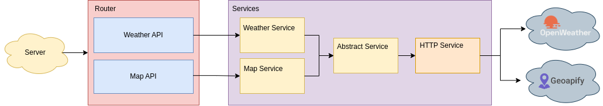

# Weather Webservice Backend

This repository comprises the code for the backend part of the weather service done as a course work in Kyiv Polytechnic Institute, 2023.

### Backend Overview Diagram


### Installation
1. Clone project`s [repo](https://github.com/sofiia-chorna/weather-webservice-backend):

    ```
    git clone https://github.com/sofiia-chorna/weather-webservice-backend.git
    ```
2. In the command line (terminal) go to the repo folder:

    ```
    cd weather-webservice-backend
    ```

2. Install all required packages from ```package.json``` with the command:

    ```
    npm install
    ```

3.  In the root folder create a file **.env** and copy the contents of the file **.env.example** into it.

    Replace in file **.env** key values to real.

4. To start the server in the command line (terminal), run:

    ```
    npm start
    ```
5. To run tests in the command line (terminal), run:

    ```
    npm test
    ```

### Services Class Diagram


### Server State Diagram


### External APIs:
1. [Openweathermap](https://openweathermap.org/guide)
2. [Geoapify](https://www.geoapify.com/)
